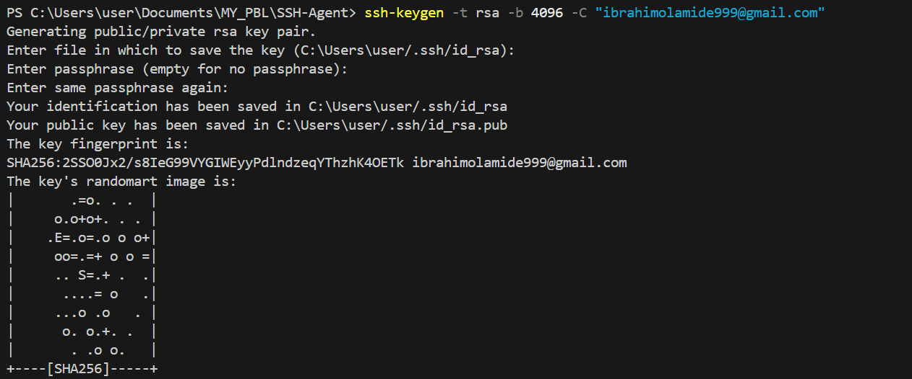
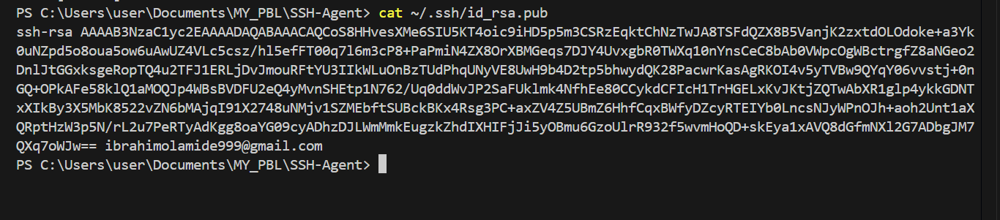
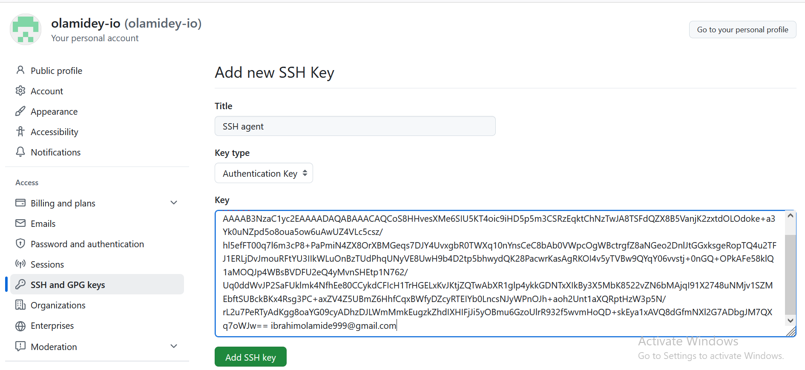

## SSH Agent Lab guide

### What is SSH Agent
Imagine you have a bunch of locked doors (servers) that you need to access frequently. Normally, each time you want to open a door, you have to take out your key (password) and unlock it. This can get tiring, right?

SSH Agent is like a personal security guard who holds your key for you. Instead of you unlocking the door every time, you give your key to the security guard once, and after that, they open the doors for you automatically whenever you need access.

### Advantage
* Convenience – If you SSH into remote servers multiple times a day, typing your password each time gets frustrating. SSH Agent lets you log in without re-entering your password repeatedly.

* Security – Here’s the twist! It’s actually safer than manually typing your password all the time. Why?

  * If you're typing your password over and over, there’s a chance someone could see it, or it might get recorded by malware.
  * With SSH Agent, your key is stored securely in memory and never exposed on the screen or in logs.

* No Risk of Password Theft via Phishing – If an attacker tricks you into typing your password (e.g., on a fake login page), they can steal it. But with SSH keys and SSH Agent, there’s no password to steal!

### Step 1: Generate an ssh key pair
* Use this command to generate an ssh key pair - **ssh-keygen -t rsa -b 4096 -C "ibrahimolamide999@gmail.com"**
* Add path to save key and also add the passphrase and the randomart image representing your key loads as shown below

### Step 2: Copy your Public key to the remote server
To enable passwordless SSH access, you must copy your public SSH key and add it to your GitHub account.
* Use this command to view your public key - **cat  ~/.ssh/id_rsa.pub** as shown below

### Step 3: Add the public key to github
Login to your github - settings - SSH and GPG keys - New SSH key - add title - paste key - click add to save.
